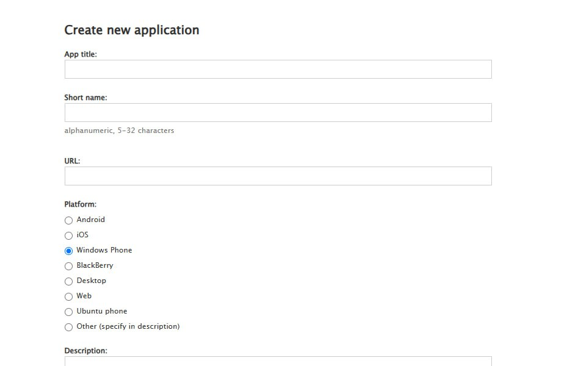
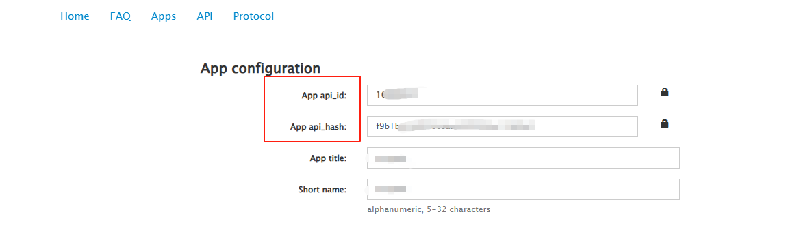
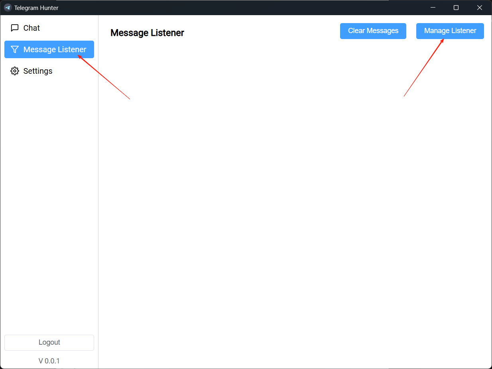
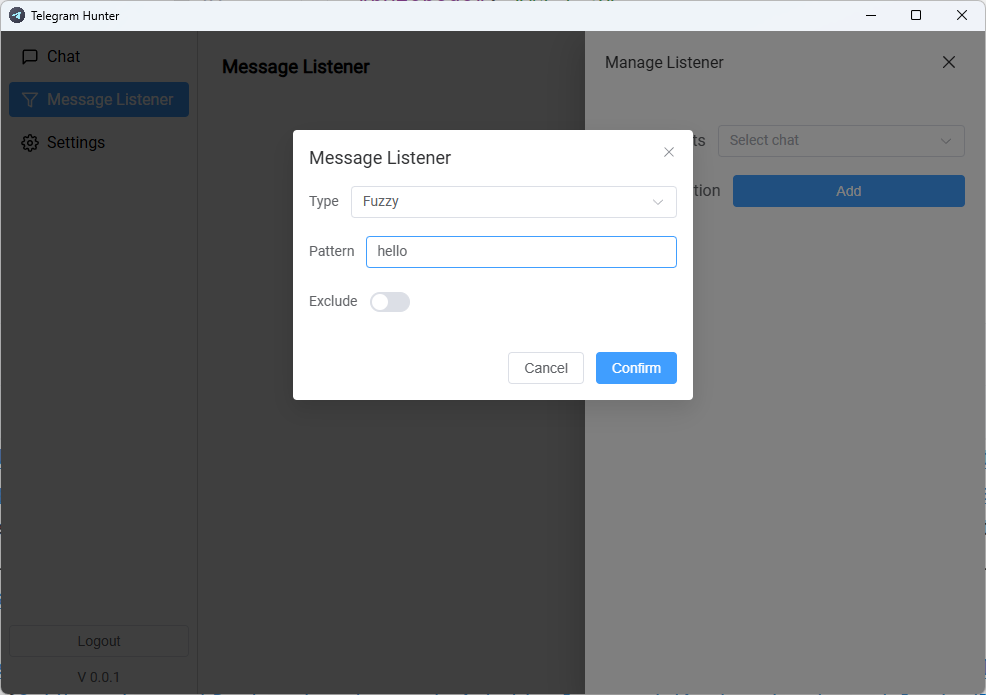

# Telegram Hunter
## 📦 Installation

...In progress

## 📖 Usage Guide
1. Get your API ID and API Hash from [my.telegram.org](https://my.telegram.org).
   Log in to my.telegram.org and go to API Development Tools.
   
2. Create a new application. Fill in the information as follows:
- `App title`: Fill in anything you like
- `Short name`: Any name (5-32 letters, must be letters)
- `URL`: Any website
- `Platform`: Select Desktop
- `Description`: Fill in anything you like  
  ::: warning
  Please use an IP from the United States or another country where Telegram is not banned when registering, otherwise you will keep getting ERROR.
  :::
  
3. Get your API ID and API Hash.
   

4. Log in with your phone number and enter the verification code you receive.
   

5. Go to `Message Listener` - `Manage Listener` to add a listener.
   
   Add the keywords you want to monitor.
   
