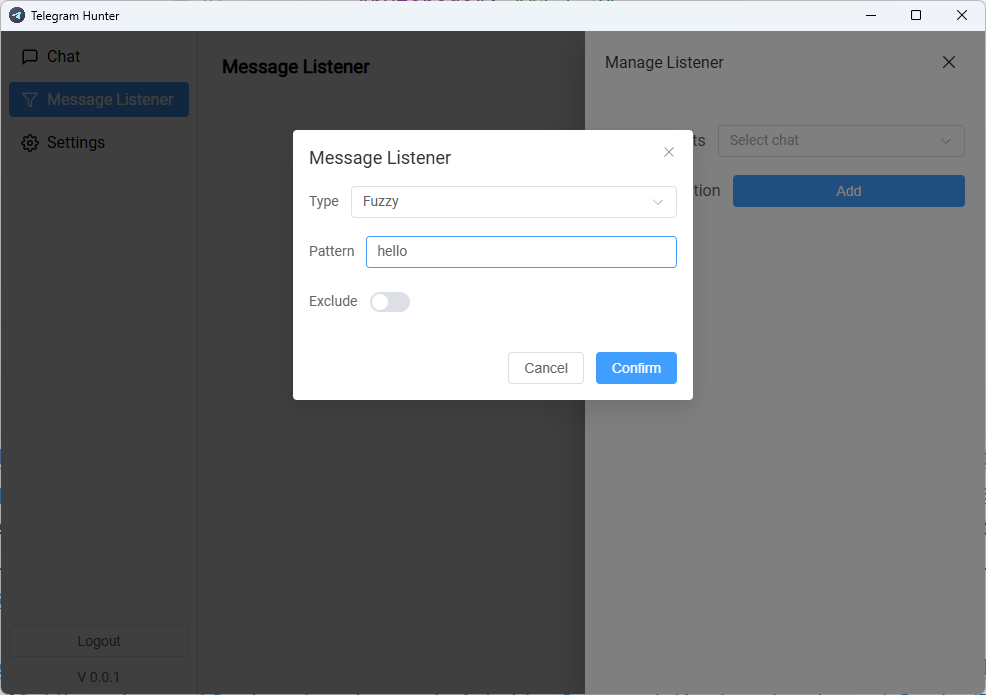

# Telegram Hunter
## 📦 Installation

Download：[GitHub](https://github.com/yee338024/telegram-hunter/releases/download/1.0.3/telegram-hunter-1.0.3-win-x64.exe)  
History Version：[Release](https://github.com/yee338024/telegram-hunter/releases)

## 📖 Usage Guide
1. Log in with your phone number and enter the verification code you receive.
   

2. Go to `Message Listener` - `Manage Listener` to add a listener.
   
   Add the keywords you want to monitor.
   
