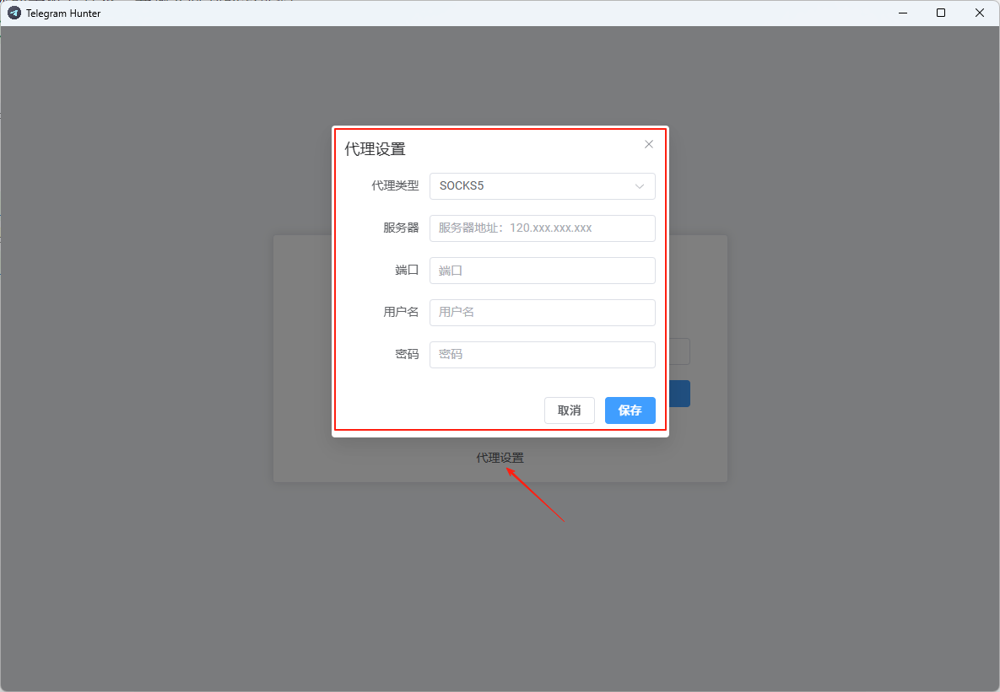
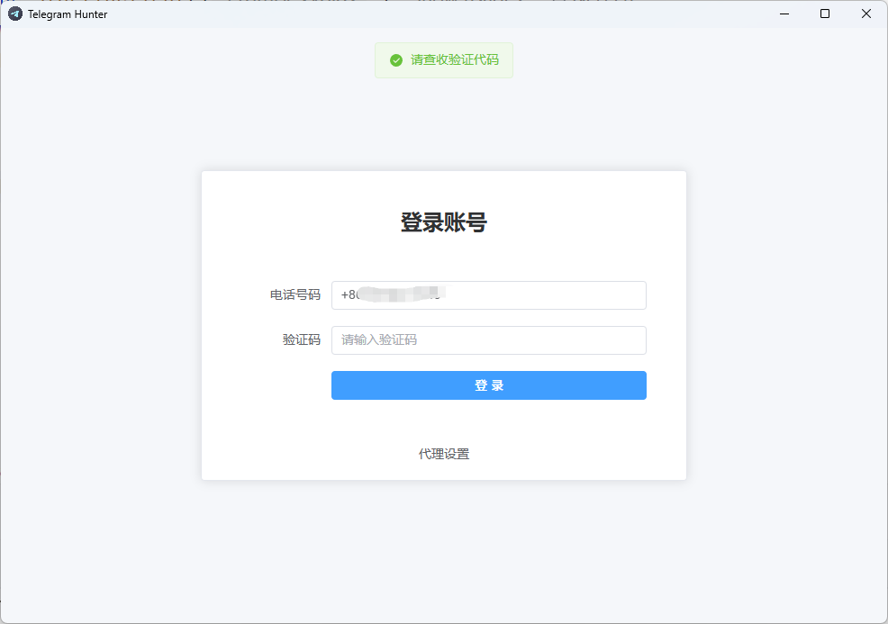
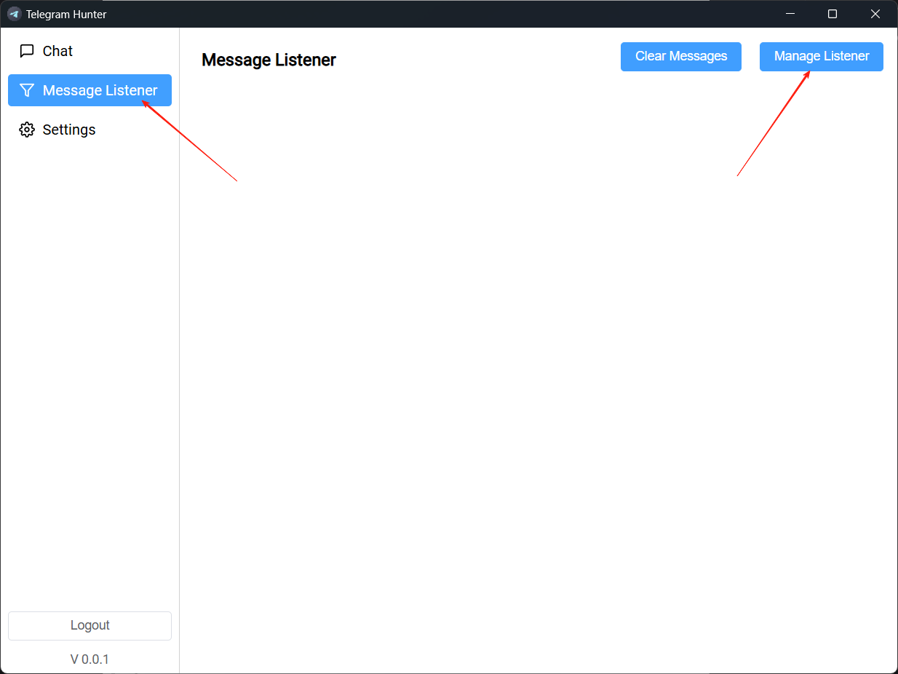
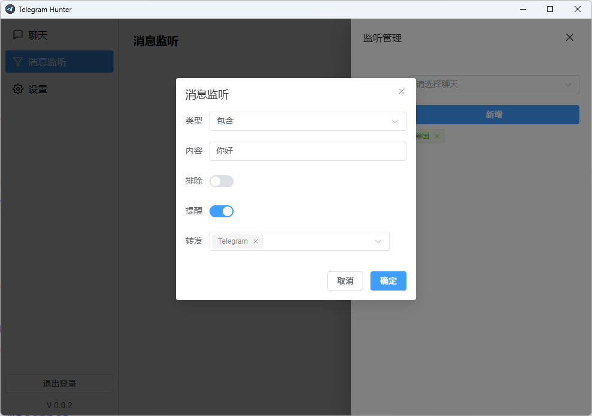

# Telegram Hunter
## 📦 安装

下载地址：[1.0.3](https://github.com/yee338024/telegram-hunter/releases/download/1.0.3/telegram-hunter-1.0.3-win-x64.exe)  
历史版本：[Release](https://github.com/yee338024/telegram-hunter/releases)

## 📖 使用方法

::: warning
如果你在中国大陆地区使用，需要先设置代理服务器和端口，如果有全局代理，则可以不用设置
:::

### 1. 使用你的手机号登录，并输入收到的验证码。

### 2. 进入 `消息监听器` - `管理监听器` 添加监听器。

#### 根据需要，添加你要监听的关键词或者转发

