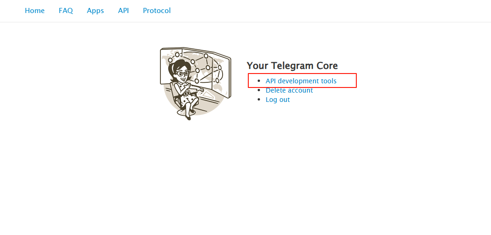

# Telegram Hunter
## 📦 安装

...编写中

## 📖 使用方法
1. 从 [my.telegram.org](https://my.telegram.org) 获取 API ID 和 API Hash。
登录 my.telegram.org，进入 API Development Tools。

2. 创建一个新应用，信息填写格式如下：
- `App title`: 随意填写
- `Short name`: 随意填写(5-32个字母，注意要字母)
- `URL`: 随意填个网址
- `Platform`：选择 Desktop
- `Description`: 随意填写  
::: warning
 注册时请使用美国或者其他没有禁止使用Telegram的国家IP，否则会一直弹出ERROR  
:::

3. 获取你的 API ID 和 API Hash。

4. 使用你的手机号登录，并输入收到的验证码。

5. 进入 `消息监听器` - `管理监听器` 添加监听器。

添加你要监听的关键词。

