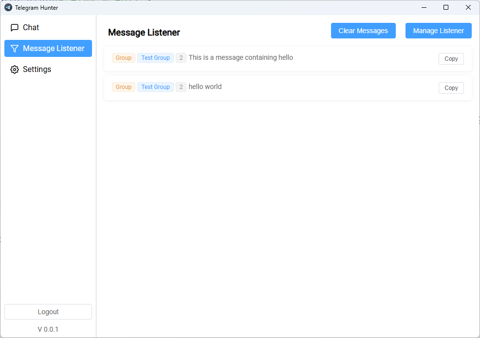
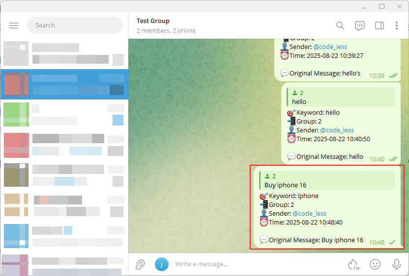
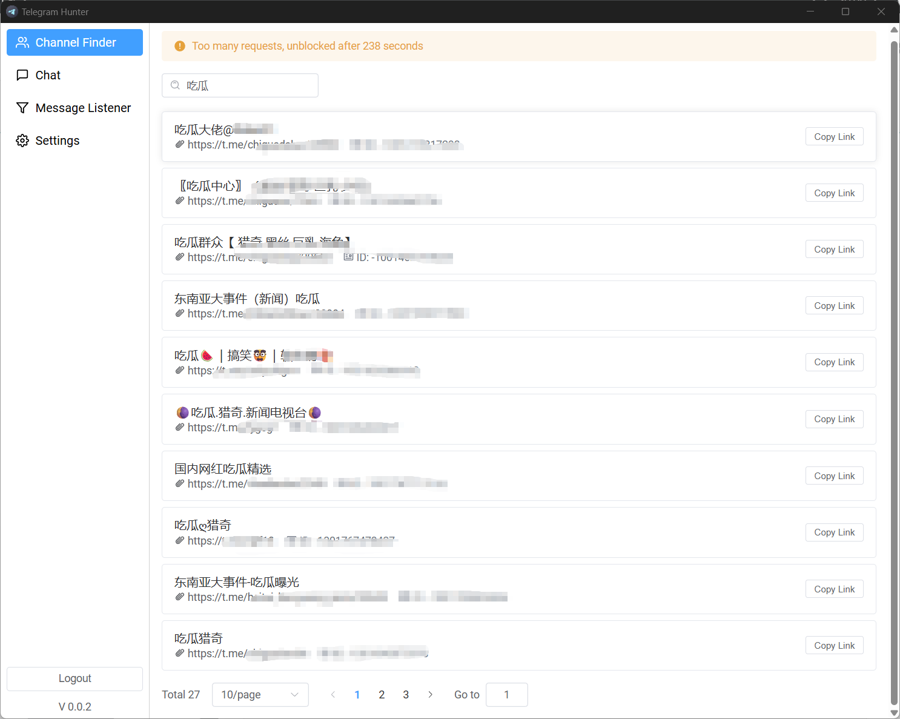

# Telegram Hunter

**Telegram Hunter** is a smart tool that helps you capture potential customers on Telegram.  
It listens to group and channel messages, detects **keywords** you care about, and notifies you instantly — making it
easier to discover and connect with new leads.

## 🚀 Key Features  

### Keyword Monitor  

Define custom keywords and let the system automatically scan Telegram messages.

### Message Forwarding  
Forward important messages to your designated chat or group automatically.

### Group & Channel Finder  
Automatically collects Group & Channel information from user messages or profiles, making it easier to discover,
organize, and manage target groups for your business or community.

---

## 🎯 Use Cases  

- **Sales & Marketing** – Discover potential buyers by tracking industry keywords.
- **Community Management** – Monitor group discussions to engage with members faster.
- **Research & Trends** – Follow conversations about products, brands, or competitors.

---

