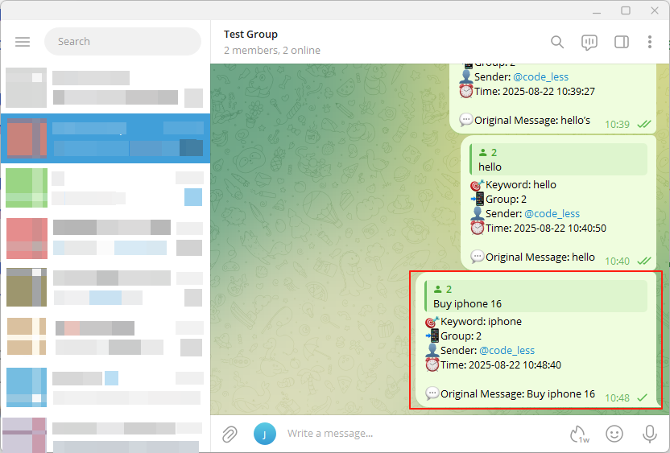

# Telegram Hunter

**Telegram Hunter** is a smart tool that helps you capture potential customers on Telegram.  
It listens to group and channel messages, detects **keywords** you care about, and notifies you instantly — making it easier to discover and connect with new leads.

---

## 🚀 Key Features

- **Keyword Monitoring**  
  Define custom keywords and let the system automatically scan Telegram messages.

- **Real-Time Alerts**  
  Get instant notifications when someone mentions topics relevant to your business.

- **Lead Generation**  
  Identify potential customers based on conversations in groups and channels.

- **Flexible Configuration**  
  Add, edit, or remove keywords anytime to fit your marketing strategy.

- **Simple & Lightweight**  
  Easy to set up, no complex technical skills required.

- **Message Forwarding**  
  Forward important messages to your designated chat or group automatically.

---

## 🎯 Use Cases

- **Sales & Marketing** – Discover potential buyers by tracking industry keywords.
- **Community Management** – Monitor group discussions to engage with members faster.
- **Research & Trends** – Follow conversations about products, brands, or competitors.

---
