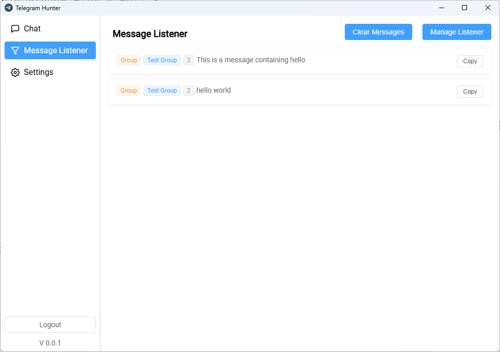
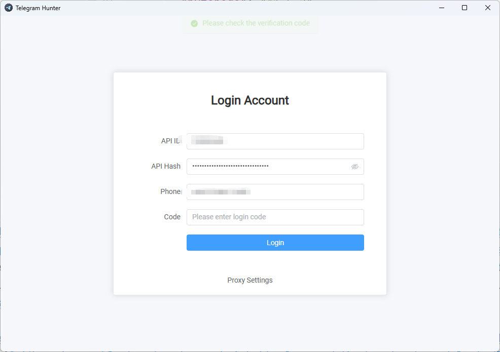
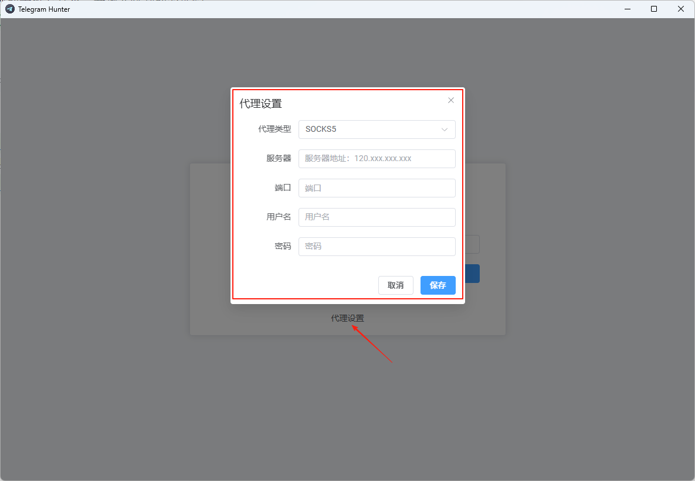

# Telegram Hunter

**Telegram Hunter** 是一款监听工具，帮助你在 Telegram 上捕捉潜在客户。
它会监听群组和频道消息，检测你添加的**关键词**，并即时通知你，让你更容易发现和联系新线索。

#### 消息监听

### 群组采集

---

## 🚀 主要功能

- **关键词监控**  
  自定义关键词，系统自动扫描 Telegram 消息。

- **实时提醒**  
  当有人提及与你业务相关的话题时，立即收到通知。

- **线索生成**  
  根据群组和频道的对话识别潜在客户。

- **灵活配置**  
  可随时添加、编辑或删除关键词，适应你的营销策略。

- **简单轻量**  
  易于设置，无需复杂技术。

- **消息转发**  
  自动将重要消息转发到指定的聊天或群组。

- **聊天群组信息自动采集**  
  系统可自动从用户消息或用户资料中采集聊天群组信息，帮助你更高效地发现、整理和管理目标群组。

---

## 🎯 应用场景

- **销售与营销** – 通过追踪行业关键词发现潜在买家。
- **社区管理** – 监控群组讨论，快速与成员互动。
- **调研与趋势** – 跟踪产品、品牌或竞争对手相关话题。

---

##   使用教程
1. 先到 [my.telegram.org](https://my.telegram.org) 获取 API ID 和 API Hash。  
登录 my.telegram.org，进入 API 开发工具，创建一个新应用程序。

获取你的 API ID 和 API Hash。

2. 填写从控制台获取到的`API ID`和`API HASH`，还有你的手机号码登录并输入收到的验证码，（手机号记得加上区号,例如+86）

如果是中国大陆地区的用户需要设置下代理，代理服务器和端口，需要根据代理软件设置来填写，如果开启了全局代理，可以跳过该步骤。

3. 再到`消息监听`-`监听管理`，添加监听关键词监听即可

